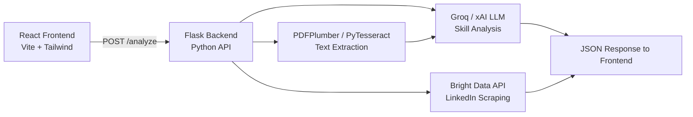

# HireLens AI — Project Summary

## What Is It?

**HireLens AI** is an AI-powered resume analysis platform that evaluates how well a candidate's resume matches a given job description. It was originally built by **Team Yuktava** as a hackathon project and has since been refactored into a modern, separated frontend + backend architecture.

---

## Architecture Overview

| Layer | Tech | Port |
|-------|------|------|
| **Frontend** | React + Vite + Tailwind CSS, React Router, Chart.js, Framer Motion | `localhost:5173` |
| **Backend** | Python Flask, Flask-CORS, PDFPlumber, PyTesseract, Pillow | `localhost:10000` |
| **AI/LLM** | Groq API (Llama 3.3 70B) or xAI (Grok-3-mini) — OpenAI-compatible | — |
| **LinkedIn** | Bright Data scraping API | — |

---

## What Has Been Built

### Backend ([backend/](file:///c:/Users/rutva/OneDrive/Documents/GitHub/hirelens-ai/backend))

| File | Purpose |
|------|---------|
| [app.py](file:///c:/Users/rutva/OneDrive/Documents/GitHub/hirelens-ai/backend/app.py) | Flask server — routes (`/`, `/health`, `/analyze`), PDF/image extraction, Bright Data LinkedIn scraper, CORS config |
| [resume_checker.py](file:///c:/Users/rutva/OneDrive/Documents/GitHub/hirelens-ai/backend/resume_checker.py) | Core analysis pipeline — orchestrates LLM calls, merges resume + LinkedIn skills, computes scores, generates final JSON response |
| [llm_service.py](file:///c:/Users/rutva/OneDrive/Documents/GitHub/hirelens-ai/backend/llm_service.py) | All LLM interactions via Groq/xAI — skill extraction, normalization, job requirement parsing, AI suggestions, hiring probability, career path suggestions |

**Analysis pipeline flow:**
1. **Extract text** from uploaded PDF (PDFPlumber) or image (PyTesseract OCR)
2. **Extract skills** from resume text via LLM
3. **Parse job description** — extract required skills, nice-to-haves, role, seniority via LLM
4. **Normalize skills** — deduplicate, standardize naming via LLM
5. **(Optional) LinkedIn enrichment** — scrape profile via Bright Data, extract additional skills
6. **Merge & match** — combine resume + LinkedIn skills, compare against job requirements
7. **Score** — `match_score` (skill overlap %) + [hiring_probability](file:///c:/Users/rutva/OneDrive/Documents/GitHub/hirelens-ai/backend/llm_service.py#177-217) (LLM-estimated) → `final_score = 0.7×match + 0.3×hiring`
8. **Generate AI suggestions** — resume tips, skills to learn, career paths (immediate + future)

### Frontend ([frontend/src/](file:///c:/Users/rutva/OneDrive/Documents/GitHub/hirelens-ai/frontend/src))

| Page / Component | Purpose |
|------------------|---------|
| [LandingPage.jsx](file:///c:/Users/rutva/OneDrive/Documents/GitHub/hirelens-ai/frontend/src/pages/LandingPage.jsx) | Hero section with CTA, 3-column features grid (Hybrid ATS Core, LinkedIn OSINT, Semantic Engine) |
| [AnalyzePage.jsx](file:///c:/Users/rutva/OneDrive/Documents/GitHub/hirelens-ai/frontend/src/pages/AnalyzePage.jsx) | Upload form — drag-and-drop resume (PDF/image), LinkedIn URL input, job description textarea, submit → calls `/analyze` API |
| [ResultsPage.jsx](file:///c:/Users/rutva/OneDrive/Documents/GitHub/hirelens-ai/frontend/src/pages/ResultsPage.jsx) | Full results dashboard — ATS score ring, match/hiring scores, skill radar chart, matched/missing skills, AI suggestions, career paths, LinkedIn profile card |
| [RadarChart.jsx](file:///c:/Users/rutva/OneDrive/Documents/GitHub/hirelens-ai/frontend/src/components/RadarChart.jsx) | Chart.js radar visualization for skill categories |
| [LinkedInProfile.jsx](file:///c:/Users/rutva/OneDrive/Documents/GitHub/hirelens-ai/frontend/src/components/LinkedInProfile.jsx) | Renders scraped LinkedIn data (name, headline, experience, education, suggestions) |

**Routing:** `/` → Landing → `/analyze` → Analysis Form → `/results` → Results Dashboard

---

## What Work Has Been Done (from past conversations)

### 1. Visual Identity Overhaul
The Results Page and shared components were refactored from a dark/neon dashboard theme to a unified **"soft premium" light-themed** visual identity matching the Landing and Analyze pages. This included auditing colors, typography, buttons, cards, inputs, and charts for consistency.

### 2. Python Environment & IDE Fixes
Multiple sessions were spent resolving **Pylance/Pyright import errors** in VS Code (for `requests`, `pdfplumber`, etc.) by correctly configuring the Python interpreter to point to the backend's virtual environment (`backend/venv`).

### 3. Local Dev Environment Cleanup
Active local servers on common ports (5000, 5173, 3000, 8000, 8080) were cleaned up to ensure a fresh environment.

---

## Deployment Setup

| Target | Platform | Config |
|--------|----------|--------|
| **Frontend** | Vercel | Framework: Vite, Root: `frontend`, Env: `VITE_BACKEND_URL` |
| **Backend** | Render | Auto-detected via [render.yaml](file:///c:/Users/rutva/OneDrive/Documents/GitHub/hirelens-ai/backend/render.yaml), Env: `BRIGHT_DATA_API_KEY` |

---

## Current State

Both servers are **currently running locally**:
- Backend: `python app.py` on port 10000
- Frontend: `npm run dev` on port 5173
